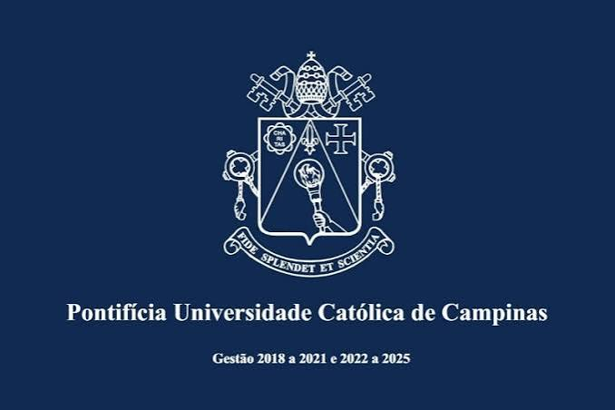

<div align="center">



# 📚 Aulas de C

### Repertório das minhas atividades de sala de aula


</div>

---

## 👋 Sobre

Este repositório reúne as **atividades e exercícios** que resolvo nas aulas de **Programação em C** na **Pontifícia Universidade Católica de Campinas (PUC-Campinas)**.

Serve como um **portfólio / repertório** do que já estudei e pratiquei em sala, organizado por aula.

## 🗂️ Estrutura

```
aulas-C/
├── assets/          # Imagens usadas no README
├── aula-01/         # Atividades da aula 01
├── aula-02/         # Atividades da aula 02
└── ...
```

> Cada pasta de aula contém os enunciados das questões e as soluções em `.c`.

## 📝 Atividades

| Aula | Tema | Questões |
|:----:|------|:--------:|
| 01 | _em breve_ | — |

## ⚙️ Como compilar e executar

Com o `gcc` instalado:

```bash
gcc arquivo.c -o programa
./programa
```

## 🛠️ Tecnologias

- **Linguagem:** C
- **Compilador:** GCC
- **Versionamento:** Git & GitHub

---

<div align="center">

Feito com 💙 durante as aulas de C · **PUC-Campinas**

</div>
